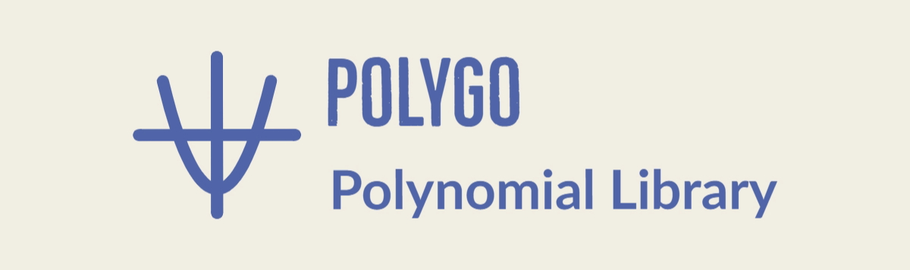

<p align="center">
    
</p>

```
go get github.com/SeanJxie/polygo@main
```
## Features

Note: Polygo is being currently being rewritten. The following features are expected to expand.

- Initialization methods:
	- From a slice of coefficients
	- Parsed from a string
	- Special polynomials:
		- Zero
		- Constant
		- Linear, Quadratic, Cubic
		- Factored form
		- Taylor (trigonometric, exp)
		- Wilkinson's
		- Chebyshev (of the first and second kind)
		- Legendre
		- Laguerre

- Binary operations:
	- Addition
	- Subtraction
	- Scalar multiplication
	- Multiplication (with fast variant using an FFT)
	- Euclidean division
	- Equality

- Unary operations/properties:
	- Evaluation (using Horner's scheme)
	- Coefficients (leading, largest, nth degree, etc.)
	- Degree
	- Reciprocal 
	- Boolean checks (constant, zero, monic, etc.)

- Calculus:
	- Derivative, nth derivative

- Solving (mildly unstable):
	- Various algorithms to solve polynomial equations (roots and intersections)
		- Newton-Raphson (real)
		- Bisection (real)
	
	- Cauchy's root bound

- Grapher:
	- Rewrite in progress

## Documentation

The current docs are outdated. They will be updated when the current rewrite is complete and
a version can be tagged.

Godoc: https://pkg.go.dev/github.com/seanjxie/polygo

